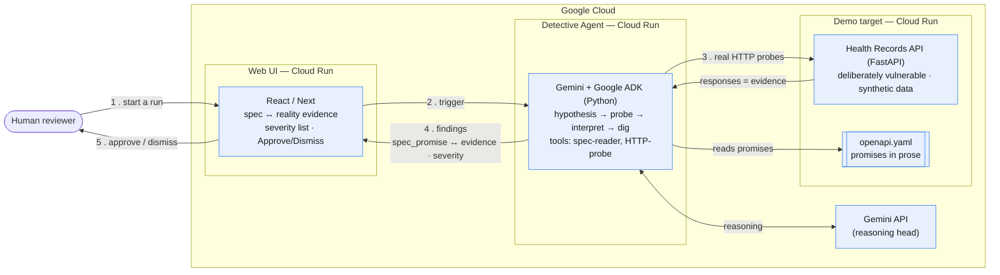
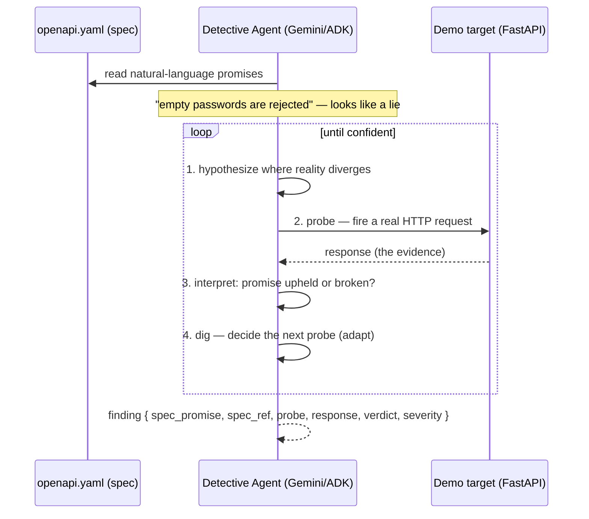

# Architecture

spec-detective runs entirely on **Google Cloud** (Cloud Run + Gemini, optionally Google ADK) with **no external dependencies** — so it survives the two-round live judging.

## System / deployment view

## Agent loop (why it must be an agent)

The loop is **adaptive against a system whose behavior it cannot predict** — it forms its own hypotheses from the spec's prose, probes, reads the reaction, and chooses the next move. That is the "AI エージェントである必然性" (judging axis ①): a fixed test suite cannot do this.

## Components

| component | tech | role |
|---|---|---|
| Web UI | React / Next, Cloud Run | shows spec (建前) ↔ reality (本音) evidence, severity-ranked; human Approve/Dismiss (HITL) |
| Detective Agent | Python, **Gemini API + Google ADK**, Cloud Run | the hypothesis→probe→interpret→dig loop; tools = spec-reader + HTTP-probe |
| Demo target | **FastAPI**, Cloud Run | a deliberately-vulnerable Health Records API (synthetic data) + `openapi.yaml` whose prose promises it secretly breaks |
| Reasoning | **Gemini API** | hypothesis generation, response interpretation, next-move decisions |

## Why this stack (judging axis ⑤)

- **All Google Cloud, zero external dependencies** → nothing third-party can break during the live-judging windows (7/13–17, 7/21–24).
- **Self-owned target** → the demo app can't go down on us; structurally avoids the biggest disqualification risk (a dead live URL).
- **ADK** makes the agent's multi-step autonomy legible (execution trace) — reinforcing axis ① and giving the UI/video something concrete to show.
- **Fallback**: if ADK costs too much time, the same loop runs on plain Gemini function-calling and still meets the required "Google Cloud AI" criterion.

> The required ProtoPedia "システム構成（システムアーキテクチャ図）" upload is exported from the system/deployment diagram above.
